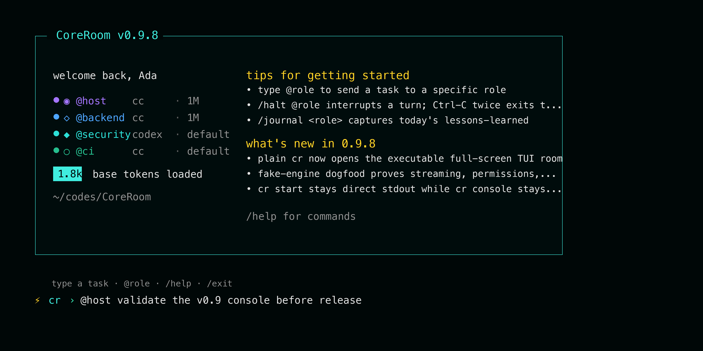
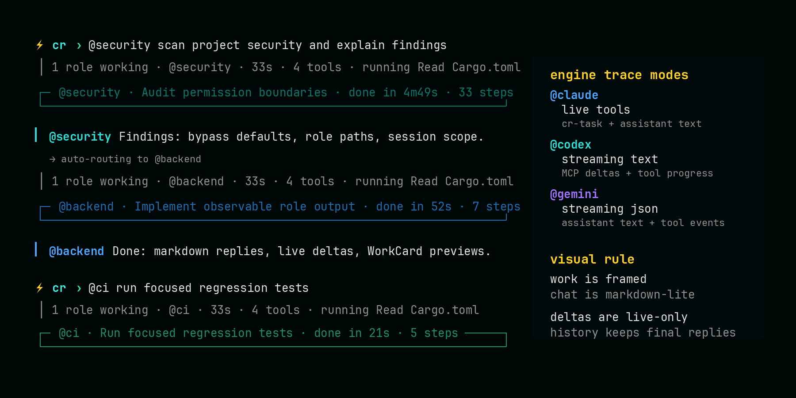
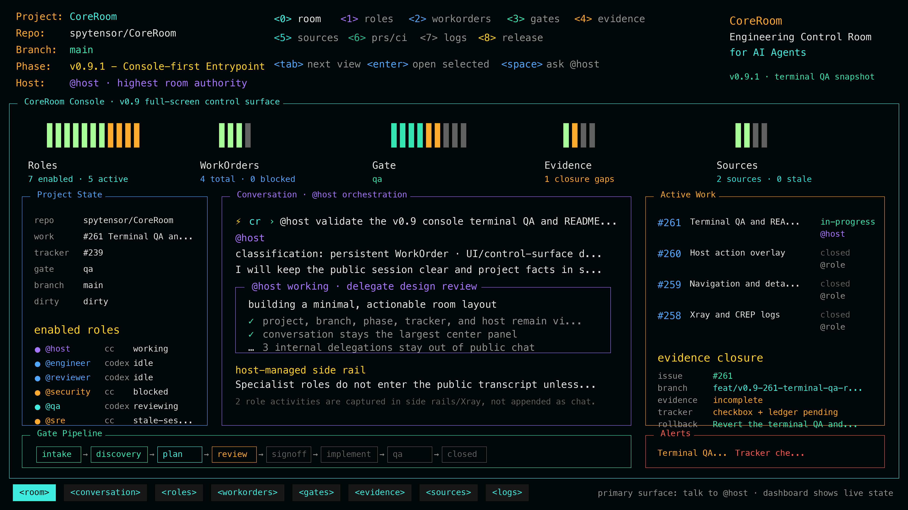

# CoreRoom

> Engineering Control Room for AI Agents: a host-led, GitHub-gated system for
> AI-assisted software engineering change.

[](https://github.com/spytensor/CoreRoom/actions/workflows/ci.yml)
[](LICENSE)







> **Status: v0.9.8 — user-runnable, still pre-1.0.** Claude Code,
> Codex, and Gemini adapters are wired up; bare `cr` opens CoreRoom
> directly, guides setup when `.coreroom/` is missing, and shows the
> effective role / engine / model configuration on entry. **v0.4.3**
> adds host-led SDLC gate ledgers and live `/compact <role|all>` for
> supported engines. **v0.4.4** fixes legacy config compatibility for
> both user and project files that still contain the removed
> `budget_per_role_usd` field. **v0.5.0** adds the virtual-team scaffold:
> `cr init --preset team`, role owners and scoped authority, role
> knowledge mounts, plan sign-off vetoes, Claude hook scaffolding,
> priors locking, and stale-priors liveness checks.
> **v0.6.0** introduced the host-led Engineering Control Room turn:
> `@host` becomes the user-facing engineering control role, with GitHub
> issue driven work, dependency context, evidence packets, and mandatory
> tracker closure. **v0.7.0** completes the CoreRoom rename across the repo,
> Rust crate, npm package, release artifacts, state directory, and environment
> variables while keeping the short `cr` command stable.
> **v0.8.0** built the console data plane: snapshots, responsive layout,
> public transcript visibility, role/work/gate/evidence/source views,
> observation-backed freshness, and dogfood evidence. **v0.9.0** adds the
> first K9s-style full-screen console: read-only ratatui rendering,
> navigation/detail panes, Xray/log views, host action overlays, and terminal
> QA fixtures for the release path. **v0.9.1** makes that console the real
> default entrypoint: plain `cr` opens the full-screen console first for an
> initialized project, then hands off to the REPL; `cr start` skips the console,
> and `cr console` opens the live local console directly. **v0.9.2** makes the
> console conversation user-first: public input/output stays in the center pane,
> host-managed specialist work appears as compact task cards, and meaningless
> unknown/placeholder state is hidden from the primary room view. **v0.9.3**
> adds role avatars for rails and delegation cards, with safe terminal glyphs
> by default and optional Nerd Font glyphs through `COREROOM_AVATAR_PACK=nerd-font`.
> **v0.9.4** added the staged unified live room path behind
> `cr console --live-room`; **v0.9.5** and **v0.9.6** tested making that
> staged surface the default. **v0.9.7** restored the truthful default while
> runtime parity was rebuilt. **v0.9.8** makes plain `cr` the executable
> full-screen TUI room: it reuses the mature role runtime, streams role output,
> surfaces permission prompts, and writes durable turn events. `cr start`
> remains the direct stdout entrypoint, and `cr console` remains the read-only
> dashboard/snapshot surface.
> Per semver, 0.x.y means the public API is not yet stable.

## Why

A single `CLAUDE.md` is a global namespace. As projects accumulate years of
conventions, one-off compliance rules, and decisions buried in commit messages
or comments, one file forces three problems: bloat, attention dilution, and
no way to express "this rule only matters to backend".

CoreRoom partitions organizational knowledge by role, then makes `@host` the
user-facing control point for turning intent into scoped work, review, evidence,
and completion. Each specialist role is a separate agent CLI subprocess loaded
with its own priors. Cross-role routing happens when one role writes an explicit
delegation line like `@x: <brief>` in its reply.

## What you get

- **Role-pinned engines.** `@backend` can run on `claude`, `@security` on
  `codex`, `@frontend` on `gemini`. No other tool does this today.
- **Host-led engineering control.** `@host` is the front door for intake,
  classification, role delegation, gate progression, evidence collection, and
  tracker closure.
- **GitHub issue discipline.** Work that needs persistence belongs in issues,
  branches, PRs, validation evidence, and milestone trackers, not transient
  chat claims.
- **One chat stream, not split panes.** Single message log per project,
  colored by role.
- **Role identity without font lock-in.** Console role rows and host-managed
  task cards keep `@role` visible while adding safe avatars; Nerd Fonts are
  an opt-in rich pack, never a hard dependency.
- **Short role priors by default.** Generated roles start with compact
  responsibilities; long procedures and reference material belong in
  the underlying engine's skills or project docs, not every role prompt.
- **Layered prompt contract.** CoreRoom's routing and WorkCard protocol is a
  built-in kernel layer; `.coreroom/shared.md`,
  `roles/<role>/priors.md`, and `roles/<role>/knowledge/` stay user-owned
  project and role standards.
- **Daily journals.** Every role writes an end-of-session log with cited
  evidence. Auto-loaded for the next 7 days.
- **Patches.** `/patch <role> "..."` saves a session-time correction; the
  role picks it up on next refresh. v0.2 promotes high-signal patches into
  base priors.
- **Explicit engine capabilities.** Claude Code currently has the richest
  wrapper-visible event stream. Codex and Gemini expose tool traces where
  their CLIs emit them, and unsupported cost / permission fields are shown
  as `—` instead of fake zeroes.
- **Permission modes.** Projects can choose `ask`, `auto`, or `bypass`.
  Claude Code is gated by a CoreRoom-injected PreToolUse hook; Codex and
  Gemini approval support follows each engine's native protocol and is shown
  only when CoreRoom can supervise it.

## Design docs

See [docs/getting-started.md](docs/getting-started.md) for setup and Claude
hook scaffolding, [docs/architecture.md](docs/architecture.md) for the v0.1 constitution,
[docs/v0.2-trust-and-interrupt.md](docs/v0.2-trust-and-interrupt.md) for
the v0.2 amendment, [docs/v0.4-calm-cli-ui.md](docs/v0.4-calm-cli-ui.md)
for the v0.4 live-surface contract, [docs/threat-model.md](docs/threat-model.md)
for routing / permission / resume trust boundaries, [docs/sdlc-gates.md](docs/sdlc-gates.md)
for host-led SDLC gate ledgers, [docs/proposed-amendments.md](docs/proposed-amendments.md)
for accepted positioning and architecture amendments, and
[docs/spike-2026-05-09.md](docs/spike-2026-05-09.md) for the feasibility spike
that grounds the whole project.

## Install

```bash
npm install -g @spytensor/coreroom
cr --version
```

That's it. `cr` is now on your PATH. Same install story as
`@anthropic-ai/claude-code`, `@openai/codex`, and `@google/gemini-cli` —
which CoreRoom drives.

Default entrypoints:

```bash
cr                         # executable CoreRoom runtime
cr start                   # explicit direct stdout runtime entrypoint
cr console                 # read-only dashboard/snapshot inspection surface
cr console --live-room     # explicit executable full-screen TUI room
```

If `cr` conflicts with an existing command in your environment, npm also
installs `coreroom` as a long-form alias for the same binary.

The npm package is a thin wrapper: on install, its postinstall script
downloads the right pre-built binary for your platform from the
matching [GitHub Release](https://github.com/spytensor/CoreRoom/releases)
and verifies its SHA-256. Supported platforms: linux + macOS, x86_64 and
aarch64.

### Update

```bash
cr update   # check the npm registry for a newer version
cr upgrade  # install and verify the latest npm package
```

`cr start` also checks for updates in the background at most once per day.
Disable that with `COREROOM_NO_UPDATE_CHECK=1` or
`[updates] check_on_start = false` in user config.

<details>
<summary>Don't have npm? Direct binary install.</summary>

```bash
TAG=v0.9.8
ARCH=$(uname -m); case "$ARCH" in arm64|aarch64) ARCH=aarch64 ;; *) ARCH=x86_64 ;; esac
OS=$(uname -s | tr '[:upper:]' '[:lower:]')
curl -fsSL "https://github.com/spytensor/CoreRoom/releases/download/${TAG}/cr-${TAG}-${OS}-${ARCH}.tar.gz" \
  | tar -xz
sudo mv "cr-${TAG}-${OS}-${ARCH}/cr" /usr/local/bin/
cr --version
```

</details>

<details>
<summary>Building from source.</summary>

Requires Rust 1.88+. Use [rustup](https://rustup.rs) — the
distro-shipped `rustc` is usually too old (we depend on `edition2024`
in the wider ecosystem).

```bash
git clone https://github.com/spytensor/CoreRoom
cd CoreRoom
cargo build --release
sudo cp target/release/cr /usr/local/bin/
```

`cargo install --git ...` works too if your active toolchain is
1.88+; otherwise the install fails inside a transitive dep.

</details>

## Engine CLIs you bring

CoreRoom never ships credentials and never calls the Anthropic / OpenAI /
Google APIs directly. It drives whatever `claude`, `codex`, and `gemini`
binaries are already on your `PATH`, using whichever auth (subscription,
Console, `ANTHROPIC_API_KEY`, `OPENAI_API_KEY`, etc.) you've configured
for them. If `cr` or `cr start` says it can't find an engine, install / log into
that engine's own CLI and try again.

> **Heads-up — Anthropic billing change effective 2026-06-15.** Anthropic
> [reclassified `claude -p` and the Claude Agent SDK](https://support.claude.com/en/articles/15036540-use-the-claude-agent-sdk-with-your-claude-plan)
> as programmatic usage drawing from a separate monthly credit pool: $20
> on Pro, $100 on Max 5x, $200 on Max 20x (non-rollover). CoreRoom uses
> `claude --print` for every role subprocess, so all CoreRoom multi-role
> sessions on a subscription count against that pool. When it runs out,
> requests stop by default (or spill to API rates if you've enabled
> "extra usage"). CoreRoom itself is unchanged — but if you run heavy
> multi-role workloads on Pro, consider Max 5x+ or `ANTHROPIC_API_KEY`
> before June 15.

## Quickstart

```bash
cd your-project
cr                              # setup if needed, then enter the room
$EDITOR .coreroom/roles/host/priors.md # optional: give @host real priors

cr › hello
[@host ready · model=claude-opus-4-7]
@host  Hi — what would you like to work on?

cr › @host scope out adding email verification
@host  This touches auth, DB schema, and probably the front-end signup flow…
```

Useful commands:

- `cr` enters the executable full-screen CoreRoom TUI room. If `.coreroom/`
  is missing, an interactive terminal gets the guided setup first.
- `cr start` is the explicit direct-runtime spelling for scripts or muscle
  memory.
- `cr console --live-room` is the explicit full-screen TUI room spelling.
  `cr console` without the flag stays the read-only dashboard.
- `cr start --yolo` runs the current session with `permission_mode=bypass`
  for every role after an interactive confirmation.
- `cr start --fresh` starts clean instead of resuming saved engine sessions.
- Existing projects with only the default `@host` role get a local-scan
  role suggestion picker on entry, so users can add specialists without
  hand-editing config.
- `cr init` runs setup explicitly when you want to prepare the project without
  entering the REPL.
- `cr role add <name> --engine codex` adds or pins a specialist role.
- `cr role host <name>` persists a new host role; `/host <role>` swaps host
  for the current REPL session only.
- `@all <text>` broadcasts one prompt to every running role.
- `/resume` lists saved CoreRoom room sessions; `/resume <number|id|prefix|latest>`
  switches every role to that saved set of engine sessions.
- `/fresh` clears saved engine session ids and restarts every role cleanly
  without leaving the REPL; use it before audits, release reviews, or other
  provenance-sensitive work.
- `/compact <role|all>` asks supported engines to compact live role context
  in-place. This is separate from `cr compact <role>`, which compacts old
  patches and journals into priors on disk.
- `/patch <role> <text>`, `/refresh <role>`, `/transcript <role>`, and
  `/journal <role>` are available inside the REPL.
- `/halt` (no arg) interrupts every in-flight turn; `/halt @role`
  targets one. Roles stay alive — only the current turn ends.
- **Ctrl-C is two-press**: first press cancels in-flight turns (like
  bare `/halt`); a second press within 2 seconds force-stops every
  role and exits the REPL. Long-running scans no longer get killed
  at any wall-clock — the wrapper trusts each engine to self-terminate
  and the user to halt when something looks wrong.
- `/allow <tool>` and `/deny <tool>` update the session permission policy
  used by Claude Code hooks. `/permissions` shows active decisions;
  `/permissions clear` resets them for a fresh review. Examples:
  `/allow Read`, `/deny Bash`.
- `cr prompt show <role>` prints the exact effective prompt for a role.
- `cr gate status|phase|role-review|override|validate|close` inspects and
  advances SDLC gate ledgers under `.coreroom/gates/`; the normal path is
  host-led, with commands kept as debug and recovery controls. Tier 0/read-only
  reviews stay inline unless the user explicitly asks for a ledger.
- `cr doctor [--fix]` detects old projects whose `shared.md` still contains
  CoreRoom protocol text that now lives in the built-in kernel.
- `cr show [--role backend] [--tail 20] [--since YYYY-MM-DD]`, `cr cost`,
  `cr compact <role>`, `cr config get/set`, and `cr update` handle inspection,
  spend tracking, priors compaction, layered config, and package upgrades.
- `cr pointers @<role>` lists every `[[<path>#L<n>-<m>@<sha>]]` token in
  the role's priors with its current resolution status (fresh / stale /
  unresolvable). Pointers in priors auto-expand to fresh git content at
  role spawn so anchors don't rot; see `cr pointers --help` for the grammar.
- Live turns fold internal tool traces into one activity summary; `cr show`
  replays the full event log when you need to audit what happened. Set
  `COREROOM_VERBOSE_TOOLS=1` to opt the live REPL back into the full
  per-tool trace stream when you need it inline.
- Permission prompts appear only while a decision is needed. Successful
  once-only allows clear the prompt and stay out of the chat stream; session
  approvals and denials remain visible because they change what the role can
  do beyond one tool call.

## Engine Capability Matrix

| Capability | Claude Code (`cc`) | Codex | Gemini |
| ---------- | ------------------ | ----- | ------ |
| Prompt isolation | system-prompt file | MCP base instructions | requires `--system-instruction-file` |
| Tool trace events | proposed + executed | exec notifications when emitted | stream-json tool_use/tool_result |
| Cost reporting | per turn | — | — |
| Budget enforcement | native cap | — | — |
| Permission gating | `ask` / `auto` / `bypass` via PreToolUse hook | `ask` / `auto` / `bypass` via MCP approval bridge in live REPL | explicit `bypass` only |

`cr cost` excludes unsupported engines from the numeric total and marks them
with `—`. This is deliberate: older builds displayed `$0.00` for engines
that did not report reliable cost.

## Permission Modes

`permission_mode` can be set project-wide or per role:

```toml
permission_mode = "ask" # ask | auto | bypass

[roles.security]
engine = "codex"
permission_mode = "bypass"

[roles.research]
engine = "gemini"
permission_mode = "bypass"
```

- `ask` requests approval before tools that are not explicitly allowed. In a
  live REPL, Claude Code hooks and Codex MCP approvals surface as CoreRoom
  prompts; use `/allow <tool>` or choose "allow session" when you trust the
  call. Existing allow/deny policy is surfaced at startup; use
  `/permissions clear` before audits or release reviews that need fresh
  approvals.
- `auto` allows low-risk read-only tools and asks for risky or unknown tools.
- `bypass` is explicit yolo mode. It is not required for Claude Code. Codex
  can run `ask` / `auto` only from a live REPL with a permission bridge;
  headless Codex runs still need `bypass`. In bypass mode, CoreRoom disables
  Codex's own command sandbox as well as approvals, matching the yolo semantics
  of the other adapters.
- For compatibility with projects created before per-role permission modes,
  Codex and Gemini roles that omit `permission_mode` run as `bypass`.
  Explicit `ask` or `auto` on Gemini still fails fast.

## Contributing

See [CONTRIBUTING.md](CONTRIBUTING.md). TL;DR: PRs follow conventional
commits, must pass `fmt + clippy + test` in CI, and must not amend a locked
architecture decision without an entry in
[`docs/proposed-amendments.md`](docs/proposed-amendments.md).

## License

MIT. See [LICENSE](LICENSE).
